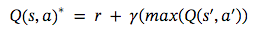
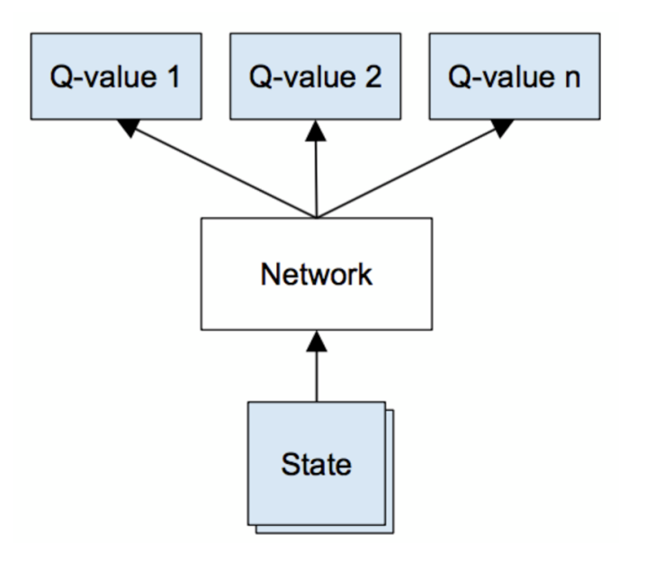

# Q Learning

각 상태에서의 값을 학습하여 특정 상태에서 가장 최적의 액션을 수행하도록 하는 방식.

## 테이블식 접근

주어진 환경에서 가능한 모든 상태와 액션에 대한 값의 테이블로 표현.

테이블의 각 셀에서 어떤 상태에서 특정 액션을 취했을 때 그것이 얼마나 좋은지 수치화한 값을 학습.

**벨먼방정식**을 이용해 Q테이블을 업데이트하는데, 주어진 액션에 대해 기대되는 장기 보상이 현재의 액션에서 얻는 즉각적 보상과 다음 상태에서 취할 최선의 미래의 액션에서 기대되는 보상의 조합과 같다는 내용.

어떤 상태 s와 액션 a에 대한 최적의 Q값은 현재의 보상 r과 다음 상태(s')에 대해 테이블에 의해 기대되는 할인된 (gamma) 최대 미래 보상의 합으로 표현할 수 있다는 것이다.

할인 계수 감마를 사용함으로써 현재의 보상에 비해 미래의 가능한 보상이 얼마나 중요한 지 비율을 정할 수 있다.

## 신경망을 통한 Q러닝

현실에서는 테이블 예제처럼 16 * 4 테이블의 형태로 상태를 기술할 수 없다.

신경망을 사용하여 상태의 수가 아무리 많더라도 이를 벡터로 표현하여 Q값에 매핑하는 방법을 학습할 수 있다.

FrozenLake 예제를 신경망으로 표현한다면, 1 x 16 벡터의 형태, 즉 원 핫 벡터로 인코딩된 상태를 입력받아 4개의 Q 값 벡터를 출력하는 1계층 네트워크를 구성할 수 있다.

이 네트워크의 가중치가 테이블의 셀 역할을 하게 된다.

계층, 활성화 함수, 다양한 입력을 추가함으로써 테이블 방식에 비해 네트워크를 쉽게 확장할 수 있다.

네트워크에서는 역전파와 비용 함수르 이용하여 네트워크를 업데이트한다.

보통 비용함수로는 제곱합을 사용하는데, 현재 예측한 Q 값과 타깃 Q 값 간의 차이를 계산하여 그 경사가 네트워크에 전달되는 방식이다.

# QN에서 DQN으로

1. 단일 계층 네트워크를 다계층 합성곱 네트워크로 확장
2. 경험 리플레이의 구현 - 네트워크가 자신의 경험에 저장된 기억을 이용해 스스로 학습
3. 제 2의 타깃 네트워크를 활용하여 업데이트 시 타깃 Q값을 계산

## 다계층 합성곱 네트워크로 확장 

기존의 Q 러닝을 위해서는 State와 Action을 정의할 필요가 있다.

하지만 현실에서는 State와 Action을 FrozenLake 처럼 확정하기가 쉽지 않다.

벽돌깨기 게임 같은 경우 공의 위치, 블럭의 위치, 플레이어의 위치가 모두 하나의 State를 나타낸다.

이렇게 복잡한 State를 하나하나 정의해 줄 수 없으므로 각 요소의 위상차를 나타내는 스크린샷을 네트워크에 전달하여 State로 사용한다.

위상차를 나타내기 위해서는 최소 2 프레임 이상의 스크린샷이 필요하며 DQN에서는 4개의 스크린샷을 State 정보로 활용하고 있다.

State에서 특징을 추출하기 위해 CNN을 사용하고 그 특징을 이용하여 Q값을 반환하는 네트워크를 생성한다.

## 경험 리플레이

학습 중 얻은 값 (s, a, r, s`)들을 모두 replay memory에 저장해 뒀다가 타깃 네트워크를 업데이트할 때 랜덤하게 샘플링해서 활용한다.

이를 통해 Q 네트워크가 local minimum에 빠질 확률을 줄이고 연산이 한결 안정화되도록 한다.

## 타깃 네트워크 

아래 Double DQN 참조 

타깃 네트워크의 업데이트는 개발자가 미리 정의한 주기로 한번씩 업데이트된다.

회귀 분석에서의 learning rate와 같은 역할을 하여 Q값이 더 원활하게 수렴되도록 하는 효과가 있다.

## Double DQN

DQN이 각 상태에서 잠재적 액션의 Q값을 종종 과대평가하는 경우가 발생

학습 단계에서 타깃 Q 값을 계산할 때 Q 값들에서 최대값을 구하는 대신, 1 네트워크를 이용하여 액션을 선택하고 해당 액션에 대한 타깃 Q 값을 타깃 네트워크에서 생성하는 방법

## Dueling DQN

Q값을 계산할 때, 

특정 상태가 다른 상태보다 얼마나 더 좋은 지를 나타내는 value function과 특정 액션이 다른 액션에 비해 얼마나 더 좋은 지를 나타내는 advantage function을 분리하여 계산하고

마지막 계층에서만 조합하여 하나의 Q 함수로 만드는 방법

상태와 액션을 분리하여 계산함으로써 더욱 안정적인 추정값을 얻을 수 있다.

# 참고자료

- [https://github.com/golbin/TensorFlow-Tutorials](https://github.com/golbin/TensorFlow-Tutorials)
- [오픈AI 블로그 베이스라인 DQN](https://blog.openai.com/openai-baselines-dqn/)
- [Towards Data Science - DQN](https://towardsdatascience.com/welcome-to-deep-reinforcement-learning-part-1-dqn-c3cab4d41b6b)
- [강화학습 기초 책](https://legacy.gitbllook.com/book/dnddnjs/rl/details)
- [DQN 개요 Qlearning -> DQN](https://jay.tech.blog/2017/01/10/deep-q-network-dqn/)
- [Torch로 배우는 DQN](https://www.popit.kr/torch-dqn-%EA%B0%95%ED%99%94%ED%95%99%EC%8A%B5-%EC%86%8C%EA%B0%9C/)