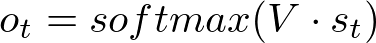
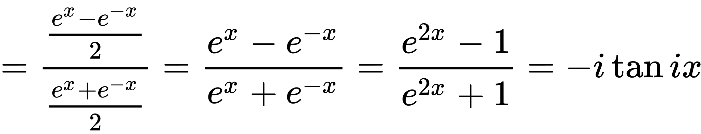
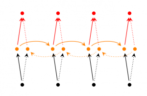

# RNN 개요

RNN은 주로 다음과 같은 영역에서 사용된다.

- 자연어 처리 (NLP)
- 언어 모델링 / 텍스트 생성
- 자동 번역
- 음성 인식
- 이미지 / 비디오 캡션 생성
- 대화 / 질의 응답 모델링
- 이미지 / 음악 / 댄스 생성

RNN의 기본 아이디어는 순차적인 정보를 처리하는 것.

실세계에서 입력과 출력은 완전히 독립적일 수 없다. 예를들어 문장에서 다음에 나올 단얼르 추측하기 위해선 이전 단어를 알아야만 한다.

RNN은 동일한 태스크를 한 시퀀스의 모든 요소마다 적용하고, 출력은 이전의 계산 결과에 영향을 받는다.

# RNN의 구조

아래는 RNN의 기본 구조이다.

입력 x가 주입되는 만큼의 스텝이 반복된다.

- xt : 시간 t 에서의 입력 값 
- st : 시간 t 에서의 hidden state
    - 이전 스텝의 hidden state값과 현재 스텝의 입력값에 의해 계산됨
- ot : 시간 t 에서의 출력값
    - 보통 softmax 함수를 사용하여 계산한다.
    - 

St는 과거에 일어난 일들에 대한 정보를 전부 담고 있는 네트워크의 메모리라고 생각할 수 있다.

Ot는 오로지 현재 시간의 메모리에만 의존한다.

RNN은 모든 스텝에 대해 동일한 파라미터 (U, V, W)를 사용한다. 즉, 각 스텝마다 입력값만 다를 뿐 동일한 계산을 한다.

RNN은 다음과 같이 입력과 출력을 다양하게 만들 수 있다.

## Hidden State **St**

첫번째 hidden state를 계산하기 위한 s는 0으로 초기화한다.

비선형 함수 f는 보통 **tanh** 또는 **ReLU**가 사용된다.

### tanh 함수

tanh 함수는 쌍곡선탄젠트 함수로서 기본적인 형태는 sigmoid 함수와 매우 유사하게 생겼다.

# RNN 학습

네트워크의 각 스텝마다 파라미터들이 공유되므로 기존의 Backpropagation (역전파) 알고리즘을 사용할 수 없다.

역전파를 사용할 경우 각 스텝마다 파라미터가 달라지므로 전체 네트워크의 일관성이 사라지므로 RNN이 아니게 된다.

따라서 Backpropagation Through Time (BPTT)라는 변형 알고리즘을 사용한다.

# RNN 확장

## Bidirectional RNN

출력값이 이전 시간 외에 이후 시간에서 들어오는 입력값에 의해서도 영향을 받을 수 있다는 아이디어

영어 문장 같은 경우는 이전의 단어만이 아니라 이후의 단어를 통해서도 문맥이 결정되는 경우가 있다.

한 시간에 두개의 RNN이 동시에 존재한다.
한 RNN은 이전 시간으로부터 영향을 받고 다른 RNN은 이후 시간으로부터 영향을 받는다.

출력은 두 RNN의 상태에 모두 영향을 받는다.

## Deep RNN

bidirectional RNN과 유사하지만 layer가 더 깊다.

따라서 학습 용량이 더욱 크다.

## LSTM Network

# 참고자료

- [모두를 위한 머신러닝](https://hunkim.github.io/ml/)
- [Team AI Korea 블로그 -  RNN 튜토리얼](https://aikorea.org/blog/rnn-tutorial-1/)
