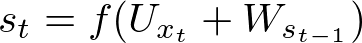
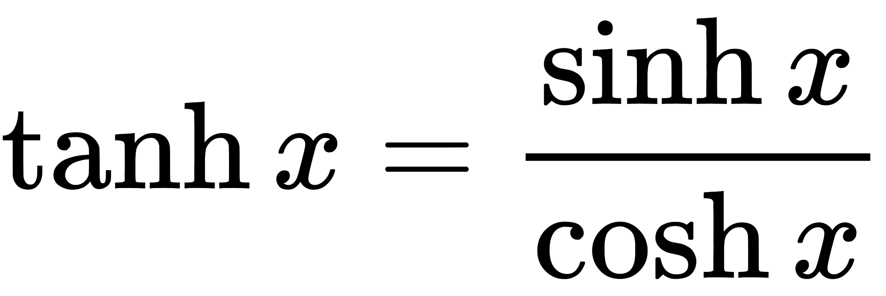
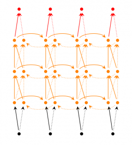

# RNN 개요

RNN은 내부에 루프를 가진 네트워크이다.
그 루프는 정보가 네트워크 내부에서 지속되게 만든다.

RNN은 주로 다음과 같은 영역에서 사용된다.

- 자연어 처리 (NLP)
- 언어 모델링 / 텍스트 생성
- 자동 번역
- 음성 인식
- 이미지 / 비디오 캡션 생성
- 대화 / 질의 응답 모델링
- 이미지 / 음악 / 댄스 생성

RNN의 기본 아이디어는 순차적인 정보를 처리하는 것.

실세계에서 입력과 출력은 완전히 독립적일 수 없다. 예를들어 문장에서 다음에 나올 단얼르 추측하기 위해선 이전 단어를 알아야만 한다.

RNN은 동일한 태스크를 한 시퀀스의 모든 요소마다 적용하고, 출력은 이전의 계산 결과에 영향을 받는다.

# RNN의 구조

아래는 RNN의 기본 구조이다.

입력 x가 주입되는 만큼의 스텝이 반복된다.

- xt : 시간 t 에서의 입력 값 
- st : 시간 t 에서의 hidden state
    - 이전 스텝의 hidden state값과 현재 스텝의 입력값에 의해 계산됨
- ot : 시간 t 에서의 출력값
    - 보통 softmax 함수를 사용하여 계산한다.
    - 

St는 과거에 일어난 일들에 대한 정보를 전부 담고 있는 네트워크의 메모리라고 생각할 수 있다.

Ot는 오로지 현재 시간의 메모리에만 의존한다.

RNN은 모든 스텝에 대해 동일한 파라미터 (U, V, W)를 사용한다. 즉, 각 스텝마다 입력값만 다를 뿐 동일한 계산을 한다.

RNN은 다음과 같이 입력과 출력을 다양하게 만들 수 있다.

## Hidden State **St**

첫번째 hidden state를 계산하기 위한 s는 0으로 초기화한다.

비선형 함수 f는 보통 **tanh** 또는 **ReLU**가 사용된다.

### tanh 함수

tanh 함수는 쌍곡선탄젠트 함수로서 기본적인 형태는 sigmoid 함수와 매우 유사하게 생겼다.

# RNN 학습

네트워크의 각 스텝마다 파라미터들이 공유되므로 기존의 Backpropagation (역전파) 알고리즘을 사용할 수 없다.

역전파를 사용할 경우 각 스텝마다 파라미터가 달라지므로 전체 네트워크의 일관성이 사라지므로 RNN이 아니게 된다.

따라서 Backpropagation Through Time (BPTT)라는 변형 알고리즘을 사용한다.

# RNN의 문제

## 장기 의존성 문제 (The Problem of Long-Term Dependencies)

적절한 정보와 그 정보가 필요한 곳의 거리가 가까운 경우, 

예를들어 "구름이 하늘에 떠 있다" 라는 문장에서 구름 다음에 하늘이라는 단어가 올 것이란 것을 예측하고자 할때, 

구름이라는 문맥만으로 충분하다.

하지만 거리가 멀어질 수록 RNN의 학습능력이 떨어진다.

dependency를 더 long-term으로 가져갈수록 gradient 값이 시간에 따른 곱하기 형태가 되어 gradient growth가 exponential해지기 때문이다 (역시 위와 마찬가지로 나중에 더 자세하게 다루도록 하겠다

LSTM을 통해 장기 의존성 문제를 해결할 수 있다.

# RNN 확장

## Bidirectional RNN

출력값이 이전 시간 외에 이후 시간에서 들어오는 입력값에 의해서도 영향을 받을 수 있다는 아이디어

영어 문장 같은 경우는 이전의 단어만이 아니라 이후의 단어를 통해서도 문맥이 결정되는 경우가 있다.

한 시간에 두개의 RNN이 동시에 존재한다.
한 RNN은 이전 시간으로부터 영향을 받고 다른 RNN은 이후 시간으로부터 영향을 받는다.

출력은 두 RNN의 상태에 모두 영향을 받는다.

## Deep RNN

bidirectional RNN과 유사하지만 layer가 더 깊다.

따라서 학습 용량이 더욱 크다.

## LSTM Network

LSTM은 오랫동안 정보를 기억하고자 하는 네트워크이다. 

LSTM은 일반적인 RNN과는 다르게 모듈 내부에 상호작용하는 네 개의 층이 추가로 존재한다.

LSTM의 핵심은 다이어그램의 위쪽은 관통해 지나가는 셀 상태에 있다.

셀 상태를 통해 정보는 전체 네트워크를 통과해 흘러갈 수 있다.

LSTM은 게이트를 통해 셀 상태에 정보를 더하거나 지울 수 있다. 이 게이트는 시그모이드 신경망 층과 요소별 곱셈 연산으로 구성된다.

LSTM 첫단계는 셀 상태에서 어떤 정보를 버릴지 결정하는 forget 게이트층이다. 
여기서는 정보를 유지할 지, 제거할지를 결정한다.

두번째 단계에서는 어떤 새로운 정보를 셀 상태에 저장할 지 결정한다. 이 단계는 두 부분으로 구성되는데, 
첫번째 input 게이트 층에서는 어떤 값을 갱신할 지 결정한다. 두번째 tanh층에서는 셀 상태에 더해질 후보값들의 벡터를 만들고 두 값을 합쳐 셀 상태에 반영한다.

여기까지 여기까지 나온 값으로 셀 상태 값을 새로운 값으로 갱신한다.

마지막 단계에서는 무엇을 출력할지 결정한다.
이 단계는 시그모이드 층으로 이루어져 셀 상태를 필터링 한다.

# 참고자료

- [모두를 위한 머신러닝](https://hunkim.github.io/ml/)
- [Team AI Korea 블로그 -  RNN 튜토리얼](https://aikorea.org/blog/rnn-tutorial-1/)
- [RNN, LSTM 번역](http://whydsp.org/280)
- [RNN, LSTM 위 번역의 원문](http://colah.github.io/posts/2015-08-Understanding-LSTMs/)
- [RNN 논문 리뷰](http://sanghyukchun.github.io/89/)
