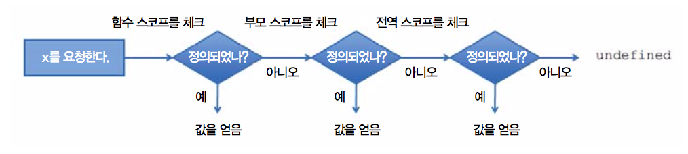
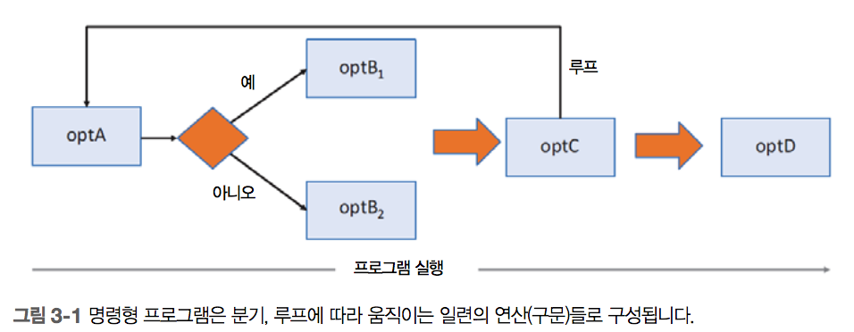
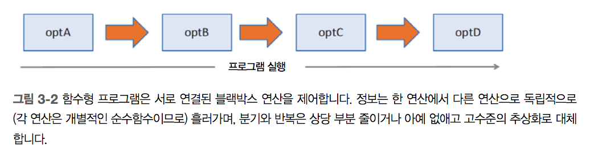
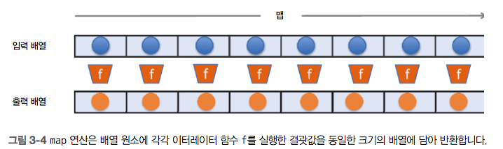
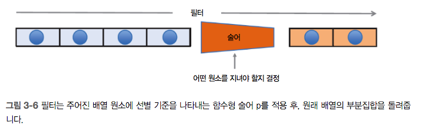
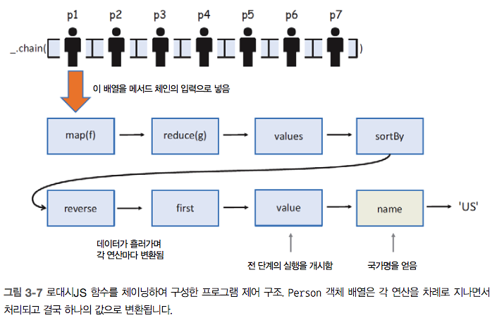
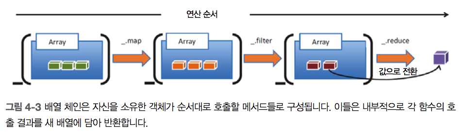
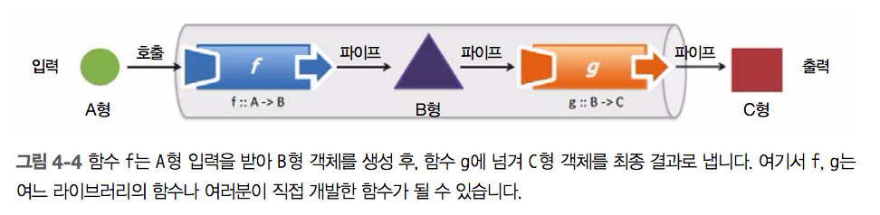

# 2.4. 클로저와 스코프

클로저는 함수를 선언할 당시의 환경에 함수를 묶어둔 자료구조.

함수 선언부의 물리적 위치에 의존하므로 정적 스코프 또는 어휘 스코프라고 한다.

함수가 자신을 둘러싼 주변 상태에 접근할 수 있으므로 명확하고 가독성 높은 코드 작성 가능.

고계함수를 응용한 함수형 프로그래밍뿐만 아니라 이벤트 처리 및 콜백, 프라이빗 변수 모방, 자바스크립트의 약점을 보완하는 용도로 유익.

일반적으로 함수의 클로저는 다음 두가지를 포함한다.

- 모든 함수 매개변수
- 전역 변수를 포함해서 바깥 스코프에 위치한 모든 변수, additionalVars 함수 이후에 선언된 변수들도 포함.

## 2.4.1. 전역 스코프의 문제점

전역 스코프에는 스크립트 최외곽에 선언된 객체 및 변수가 자리하고, 모든 스크립트에서 접근 가능.

이름 공간이 충돌할 가능성이 매우 높고 의도치않게 재정의 문제 및 부수 효과 발생 가능성 높다.

## 2.4.2. 자바스크립트의 함수 스코프

함수 스코프는 var에서 사용되는 가장 기본적인 스코프 방식.

함수 내부에 선언된 변수는 모두 해당 함수의 지역 변수라서 다른 곳에서는 안보이고, 함수가 반환된는 시점에 모두 사라짐.

스코프 로직은 다음과 같다.

1. 변수의 함수 스코프를 체크
2. 지역 스코프에 없으면 자신을 감싼 바깥쪽 어휘 스코프로 이동해서 전역 스코프에 도달할 때까지 변수 레퍼런스를 계속 찾음.
3. 전역까지 참조 대상이 없으면 undefined 반환



## 2.4.3. 의사 블록 스코프

자바스크립트는 내부적으로 변수와 함수 선언부를 현재 스코프 제일 위쪽으로 호이스팅하기 때문에

```js
if (false) {
    var myVar = 10;
}
```

과 같은 코드에서 if 문 밖에서도 `myVar`을 사용할 수 있다.

ES6부터는 let 키워드로 변수를 선언하여 블록 스코프를 사용할 수 있다.

## 2.4.4 클로저 응용 - 프라이빗 변수 모방

자바스크립트에서 캡슐화를 하기 위해 클로저를 사용한다.

생성자 함수와 같이 함수가 객체를 반환할 경우, 이 객체는 자신을 감싼 함수의 지역 변수에 접근 가능한 메서드가 있다.

하지만 지역 변수 자체를 노출하지 않기 때문에 프라이빗 변수처럼 쓸 수 있다.

라이브러리나 모듈 개발자는 전역 범위의 데이터 공유를 피하기 위해 전체 모듈의 프라이빗 메서드와 데이터를 숨길 때 즉시 실행 함수로 클로저를 활용한다.

이것을 **모듈 패턴**이라고 한다.

```js
var MyModule = (function MyModule(export) {
    let _myPrivateVar = 0;

    export.method1 = function() {

    };

    export.method2 = function() {

    };

    return export;
}(MyModule || {}));
```

MyModule 객체는 전역 스코프에 생성되고 function 키워드로 만든 함수 표현식은 스크립트가 적재되는 동시에 실행됨.

## 2.4.5. 클로저 응용 - 서버 비동기 호출

서버 비동기 호출 시, 성공/실패의 콜백 함수를 인수로 받음.

함수가 객체로 저장되면서 주변 스코프를 스냅샷으로 함께 저장하는 것이 클로져이므로 콜백 함수를 인수로 받는 것 역시 클로저라고 할 수 있다.

## 2.4.6. 클로저 응용 - 가상의 블록 스코프 변수를 생성

루프를 함수형으로 풀어낸다면 클로저와 함수 스코프를 적극 활용한 forEach를 사용하는게 좋다.

forEach 함수는 함수를 인수로 받으면서 매 루프마다 해당 함수를 호출한다.

따라서 함수 내부의 변수는 루프 블록 내의 지역 변수처럼 동작한다.

--- 

# 3.1. 애플리케이션의 제어 흐름




함수형 프로그래밍을 할 경우 코드가 다음과 같이 짧아진다.

```js
optA().optB().optC().optD();
```

# 3.2 메서드 체이닝

메서드 체이닝은 여러 메서드를 단일 구문으로 호출하는 OOP 패턴.

메서드가 모두 동일한 객체에 속한 경우 메서드 흘리기라고 부르기도 한다.

주로 불변객체에 대해 많이 적용하는 패턴이다.

```js
'Functional Programming'.substring(0, 10).toLowerCase() + ' is fun';
```

# 3.3 함수 체이닝

객체지향 프로그램은 주로 상속을 통해 코드를 재사용한다. 즉, 자료구조를 새로 만들어 내고 내부 코드를 조금씩 바꿔 재사용.

함수형 프로그래밍은 흔한 자료구조를 이용해 다수의 굵게 나뉜 고계 연산을 적용.

- 작업 수행을 위해 무슨 일을 해야 하는지 기술된 함수를 인수로 받음
- 임시 변수의 값을 계속 바꾸면서 부수 효과를 일으키는 기존 코드를 대체.

## 3.3.1 람다 표현식

람다 표현식은 반드시 값을 반환하는 익명 함수를 단축한 문법이다.

```js
const name = p => p.fullname;
```

람다 표현식은 항상 어떤 값을 반환하여 함수 정의부를 확실히 함수형으로 굳힌다.


## 3.3.2 _.map: 데이터를 변환



## 3.3.3 _.reduce: 결과를 수집


reduce는 누산치에 의존하기 때문에 결합법칙이 성립하지 않는 연산은 진행 순서에 따라 결과가 달라질 수 있다.

배열의 각 요소를 더하는 연산은 결합 법칙이 성립하므로 순서에 상관없이 동일한 결과를 반환하지만 나눗셈같은 경우는 이터레이션 방향에 따라 결과가 달라진다.

또 reduce는 일괄적용 연산이라 배열을 순회하는 도중 그만두고 나머지 원소를 생략할 방법이 없다. 따라서 filter를 활용하여 미리 배열을 변환하거나 fn 내부에서 체크해야 한다.

## 3.3.4 _.filter: 원하지 않는 원소를 제거



## 배열 축약

배열 축약은 `map`, `filter`의 기능을 각각 `for..of`와 `if` 키워드를 이용한 단축 구문으로 캡슐화하는 함수형 장치

```js
[for (x of iterable) if (condition) x]

[for (p of people) if (p.birthYear === 1903) p.fullname].join(' and ');
```

배열 축약은 ECMAScript7 제안서에 포함되어 있다.

# 3.4 코드 헤아리기

`코드를 헤아린다` 라는 것은 프로그램의 일부만 들여봐도 무슨 일을 하는 코드인지 멘털 모델을 쉽게 구축할 수 있다는 의미.

멘털 모델이란 전체 변수의 상태와 함수 출력같은 동적 부분만이 아니라, 설계 가독성 및 표현성 같은 정적인 측면까지 포괄하는 개념.

함수형 프로그래밍에서 요구하는 불변성과 순수함수가 멘털 모델 구축을 더 용이하게 해준다.

## 3.4.1 선언적 코드와 느긋한 함수 체인

함수형 프로그램은 단순한 함수들로 구성한다. 개별 함수가 하는 일은 작지만 뭉쳐서 복잡한 작업을 해낼 수 있다.

이론적으로 말해서 배열, 연결 리스트, 이진 트리 등 어떤 자료구조를 쓰더라도 프로그램 자체의 의미가 달라져선 안된다. 그래서 함수형 프로그래밍은 자료구조보다 연산에 더 중점을 둔다.

명령형 코드의 단점은 특정 문제의 해결만을 목표로 한다. 명령형 코드에서의 함수는 한 가지 용도로 고정된다. 따라서 코드를 재사용할 기회는 줄어들고 에러 가능성과 코드 복잡성이 증가한다.

반면, 함수형 프로그램은 **블랙박스 컴포넌트**를 서로 연결만 해주고, 뒷일은 테스트까지 마친 검증된 API에게 모두 맡긴다.

`_.chain` 함수는 주어진 입력을 원하는 출력으로 변환하는 연산들을 연결함으로 입력 객체의 상태를 확장한다. 임의의 함수를 명시적으로 체이닝 가능한 함수로 만드는 역할을 한다.

```js
_.chain(persons)
    .filter(isValid)
    .map(_.property('address.country'))
    .reduce(gaterStats, {})
    .values()
    .sortBy('count')
    .reverse()
    .first()
    .value()
    .name;
```



또한 제일 끝에 있는 `value()` 함수를 호출하여 값을 평가하기 전까지는 아무것도 실행되지 않으므로 연산을 느긋하게 작동시키는 역할도 한다. 결과값이 필요없는 함수는 실행을 건너뛸 수 있어 성능에 큰 영향을 미친다.

위 코드처럼 프로그램 파이프라인을 느긋하게 정의하면 가독성을 비롯해 여러 장점이 있다. 대표적으로 느긋한 프로그램은 평가 이전에 정의하기 때문에 자료구조를 재사용하거나 메서드를 융합(method fusion) 하여 최적화 할 수 있다.

고계함수를 선언적으로 사용하면 각 지점마다 데이터가 어떻게 변환되는지 분명해져서 데이터 흐름이 더 잘 보인다.

## 3.4.2 유사 SQL 데이터: 데이터로서의 함수 

함수형 프로그래밍과 SQL 언어는 형태가 유사하다.

믹스인 기능을 응용하면 핵심 라이브러리에 함수르 ㄹ추가하여 확장한 후 마치 원래 있던 함수처럼 체이닝할 수 있다.

```js
_.mixin({'select': _.map, 
            'from': _.chain, 
            'where': _.filter, 
            'sortBy': _.sortByOrder});

_.from(persons)
    .where(p => p.birthYear > 1900 && p.adress.country !== 'US')
    .sortBy(['firstname'])
    .select(p => p.firstname)
    .value();
```
위와 같이 SQL처럼 데이터를 함수 형태로 모델링하는 것을 **데이터로서의 함수**라는 개념으로 부른다.

선언적으로 어떤 데이터가 출력되어야 할지 서술할 뿐 어떻게 얻는지는 논하지 않는다.

# 3.5 재귀적 사고방식

Divide and conquer

## 3.5.1 재귀란?

재귀는 주어진 문제를 자기 반복적인 문제들로 잘게 분해한 다음, 이들을 다시 조합해 원래 문제의 정답을 찾는 기법이다.

재귀를 구성하기 위해서는 다음과 같은 요소가 필요하다.

- Base case (Terminating condition)
- Recursion case

## 3.5.2 재귀적으로 생각하기

재귀적 사고란, 자기 자신 또는 그 자신의 변형한 버전을 생각하는 것. 

사실상 순수 함수형 언어는 모든 루프를 재귀로 수행한다.

ES6 부터는 꼬리 호출 최적화가 추가되어 사실상 재귀와 수동 반복의 성능 차이는 미미해졌다.

## 3.5.3 재귀적으로 정의한 자료구조

자바스크립트에는 트리를 표현하는 기본 자료구조가 없다. 따라서 아래와 같이 직접 만들어 써야 한다.

[자바스크립트로 구현한 트리](code/code3-5.js)

# 4 재사용 가능한, 모듈적인 코드로

모듈성은 프로그램을 더 작고 독립적인 부분으로 나눌 수 있는 정도를 뜻한다.

## 4.1 메서드 체인 대 함수 파이프라인

함수 체이닝과 파이프라이닝을 이해하려면 함수를 형식간의 매핑으로 인식해야 한다.

- 메서드 체이닝 : 단단한 결합, 제한된 표현성
- 함수 파이프라이닝 : 느슨한 결합, 유연성

### 4.1.1 메서드를 여럿 체이닝

```js
_.chain(names)
    .filter(isValid)
    .map(s => s.replace(/_/, ' '))
    .uniq()
    .map(_.startCase)
    .sort()
    .value();
```

위 코드는 3장에서의 예제이다. 

자신을 소유한 객체에 부자연스럽게 매여 있어 체인에서 실행 가능한 메서드 가짓수가 줄고 코드의 표현성도 제약 받는다.

로대시js가 제공하는 연산만 쓸 수 있기 때문에 다른 라이브러리 함수나 직접 만든 함수를 쉽게 연결할 수 없다.



### 4.1.2 함수를 파이프라인에 나열

객체가 소유한 메서드만 연결할 수 있었던 메서드 체이닝의 한계에서 벗어나 출신에 관계없이 어떤 함수라도 유연하게 결합할 수 있는 것이 **파이프라이닝**이다.

**파이프라인**이란 한 함수의 출력이 다음 함수의 입력이 되게끔 느슨하게 배열한, 방향성 함수의 순차열이다.



체이닝은 객체 메서드를 통해 함수들을 단단히 결합하지만, 파이프라인은 함수 입출력을 서로 연결지어 느슨하게 결합된 컴포넌트를 만든다.

단, 파이프라인은 함수의 항수(인수의 개수)와 형식이 호환되지 않으면 연결할 수 없다.

